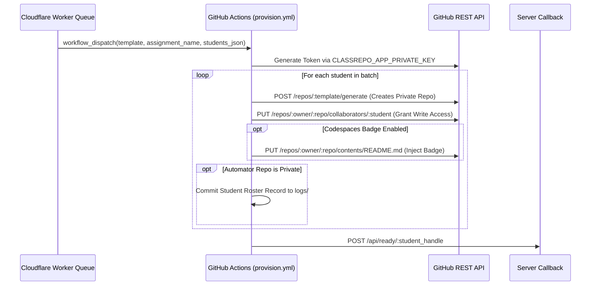

# ClassRepo Automator (`class-repo-automator`)

[](https://github.com/features/actions)
[](#security--privacy-architecture)
[](https://cli.github.com/)

**ClassRepo Automator** is the execution controller repository deployed within the instructor's academic GitHub Organization. It listens for provisioning dispatches from the ClassRepo edge server, assumes the authorized GitHub App identity, and automates the creation of private student assignment repositories.

By isolating the execution engine inside the instructor's own GitHub organization, sensitive GitHub App private keys (`.pem`) remain exclusively in GitHub Action Secrets, preserving a strict **zero-trust boundary**.

---
### 🔙 [Click here to return to the ClassRepo Setup Wizard](https://class-repo-ui.pwlewis.workers.dev/dashboard)
---

## Table of Contents

- [How It Works](#how-it-works)
- [Setup & Installation](#setup--installation)
  - [Option A: Automated Setup via Codespaces (Recommended)](#option-a-automated-setup-via-codespaces-recommended)
  - [Option B: Manual GitHub App Configuration](#option-b-manual-github-app-configuration)
- [GitHub Actions Workflow: `provision.yml`](#github-actions-workflow-provisionyml)
  - [Workflow Inputs](#workflow-inputs)
  - [Required Action Secrets](#required-action-secrets)
- [Local CLI Tool: `provision.sh`](#local-cli-tool-provisionsh)
- [Security & Privacy Architecture](#security--privacy-architecture)

---

## How It Works



---

## Setup & Installation

### Option A: Automated Setup via Codespaces (Recommended)
1. Fork or duplicate this repository into your academic GitHub Organization.
2. Click **Code > Codespaces > Create codespace on main**.
3. The devcontainer initializes automatically and launches the guided setup wizard.
4. Follow the interactive terminal instructions to generate your GitHub App. The script exchanges the credentials, saves `CLASSREPO_APP_ID` and `CLASSREPO_APP_PRIVATE_KEY` directly to your repository secrets, and cleans up the Codespace.

### Option B: Manual GitHub App Configuration
1. **Create an Executor GitHub App**:
   - In GitHub, navigate to **Settings > Developer settings > GitHub Apps > New GitHub App**.
   - Set Repository Permissions:
     - `Administration`: **Read and write**
     - `Contents`: **Read and write**
     - `Secrets`: **Read and write** (optional, for automated secret rotation)
   - Generate and download a Private Key (`.pem`).
   - Install the App on your academic GitHub Organization and select **All repositories** (or include template repos and `class-repo-automator`).
2. **Add Action Secrets**:
   - In this repository, go to **Settings > Secrets and variables > Actions**.
   - Create `CLASSREPO_APP_ID`: Enter your numerical App ID.
   - Create `CLASSREPO_APP_PRIVATE_KEY`: Paste the full contents of your `.pem` key.

---

## GitHub Actions Workflow: `provision.yml`

The primary workflow (`.github/workflows/provision.yml`) runs on `workflow_dispatch` triggered via the GitHub API.

### Workflow Inputs

| Input | Type | Required | Description |
| :--- | :---: | :---: | :--- |
| `template` | String | Yes | Source starter template repository (e.g., `org-name/hw1-starter`). |
| `assignment_name` | String | Yes | Prefix for provisioned repositories (e.g., `hw1`). |
| `students_json` | String | Yes | JSON-encoded array of students: `[{"student_handle":"alice","student_email":"alice@univ.edu"}]`. |
| `target_owner` | String | No | Target GitHub Organization (defaults to repository owner). |
| `add_codespaces` | String | No | Pass `"true"` to prepend a one-click Codespaces badge to the student's `README.md`. |
| `server_url` | String | Yes | Base URL of the ClassRepo server for completion callbacks. |

### Required Action Secrets

- `CLASSREPO_APP_ID`: Numerical ID of your installed GitHub App.
- `CLASSREPO_APP_PRIVATE_KEY`: RSA Private Key (`.pem`) used to generate short-lived installation access tokens via `actions/create-github-app-token@v1`.

---

## Local CLI Tool: `provision.sh`

For air-gapped environments, testing, or provisioning before internet connectivity is enabled, a standalone Bash script is provided in [`scripts/provision.sh`](./scripts/provision.sh).

### Prerequisites
- [GitHub CLI (`gh`)](https://cli.github.com/) installed and authenticated (`gh auth login`).
- [`jq`](https://jqlang.github.io/jq/) installed.

### Usage

```bash
./scripts/provision.sh \
  -t <template_repo> \
  -a <assignment_name> \
  -o <target_owner> \
  -f <students.json> \
  [-c]
```

### Options
- `-t`: Template repository in `owner/repo` format.
- `-a`: Assignment name prefix for student repos.
- `-o`: Target GitHub organization or user account.
- `-f`: Path to JSON file containing array of student handles.
- `-c`: Optional flag to inject GitHub Codespaces badge into student `README.md`.
- `-h`: Display help message.

### Example Student File (`students.json`)
```json
[
  { "student_handle": "student-alice" },
  { "student_handle": "student-bob" }
]
```

---

## Security & Privacy Architecture

### FERPA Compliance & Audit Logging
The workflow includes an internal audit step that logs provisioned student handles and timestamps into `logs/{assignment_name}/roster.log`.
- **Private Repository (Recommended)**: Logs are committed securely within your private organization.
- **Public Repository**: The action automatically detects public visibility and skips logging to prevent exposing student identities.

### Idempotency
All creation routines query the GitHub API before attempting to generate new repositories. If a repository already exists for a student handle, repo creation is skipped and the script proceeds directly to verifying collaborator invitation status, ensuring resilience against accidental re-runs.
